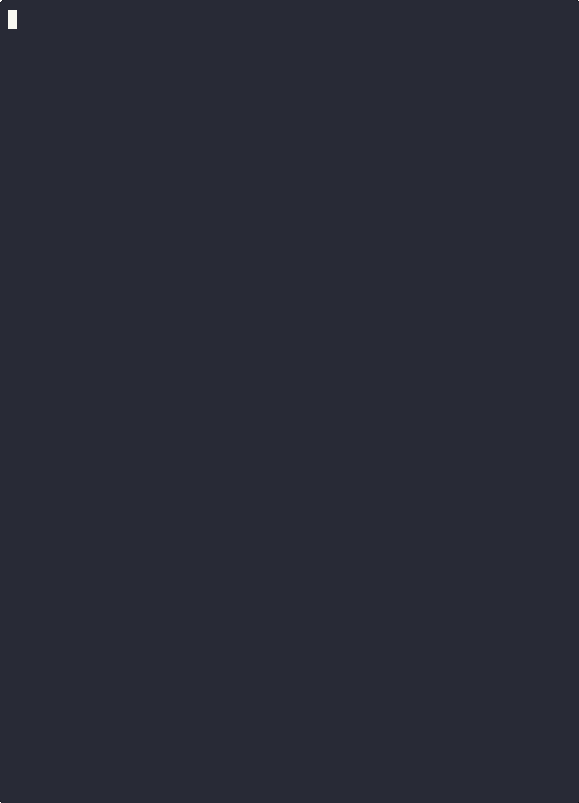

# Maze Search





```bash
cd search
./gradlew run
```

# Metrics

Replay the instrumented search logs.

```bash
cd metrics
cargo run -- assets/graph-instrumented-astar.log
cargo run -- assets/graph-instrumented-dfs.log
cargo run -- assets/graph-instrumented-bfs.log
```

# Generating animated gif assets

Install dependencies

```bash
brew install asciinema
cargo install --git https://github.com/asciinema/agg
```

Generate animated gifs

```
cd metrics
# same pattern for bfs and dfs
asciinema rec assets/astar.cast
# run ncurses animation
cargo run -- assets/graph-instrumented-astar.log
# ctrl-c to end, then ctrd-d to end asciinema recording
agg assets/astar.cast assets/astar.gif
```
